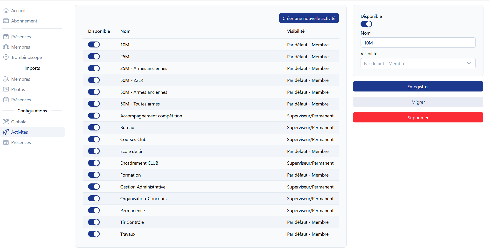

# Gestion des activités <RoleLevelComponent level="admin" />

Actions possibles :
- Changement du nom
- Configuration de la visibilité   
  Ce paramètre sera répercuté sur le formulaire d'enregistrement de présence.
- Désactivation d'une activité
- Migration d'une activité
- Suppression d'une activité
