

# Import des données <RoleLevelComponent level="admin" />

- [Import des membres](#import-des-membres)
- [Import des membres club secondaire](#import-des-membres-club-secondaire)
- [Import des certificats médicaux](#import-des-certificats-medicaux)
- [Import des photos](#import-des-photos)

## Import des membres
L'import se fait depuis un CSV généré depuis le site itac

- [Export depuis itac](#export-depuis-itac)
- [Import depuis le site](#import-depuis-le-site)

### Export depuis itac
1. Se rendre sur le **Requêteur** : https://itac.pro/Requeteur/Requeteur.aspx
2. Utiliser le modèle `Adhérents` et cliquer sur CSV
3. Si le modèle n'existe pas :
    1. Créer un nouveau modèle `Licenciés (effectifs)`  
       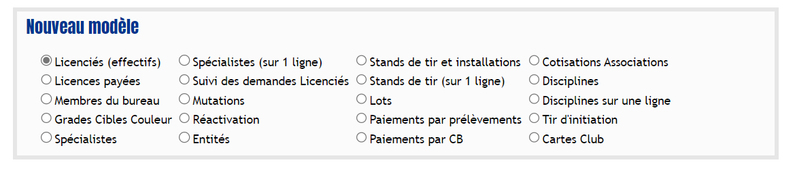
    2. Mettre tous les champs sur `Tous`
       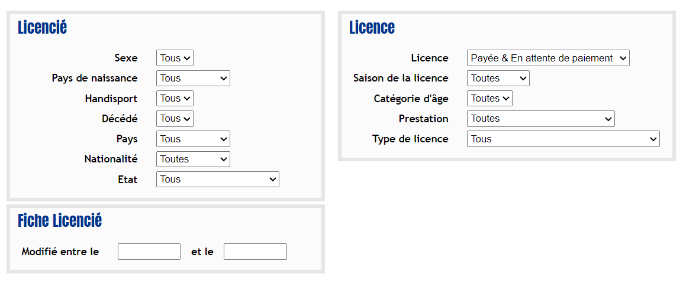
    3. Tout cocher dans `Licencié` et `Licence`
       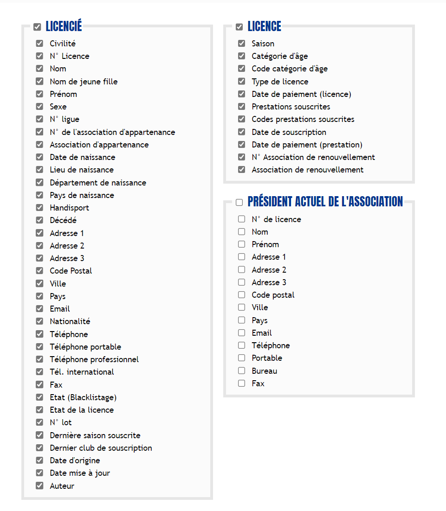
    4. Nommer le fichier `Adhérents`
    5. Cliquer sur `Sauvegarder le modèle d'extraction de données`
    6. Cliquer sur `Extraire les données au format CSV`
       L'export se télécharge automatiquement et peut prendre un peu de temps.
       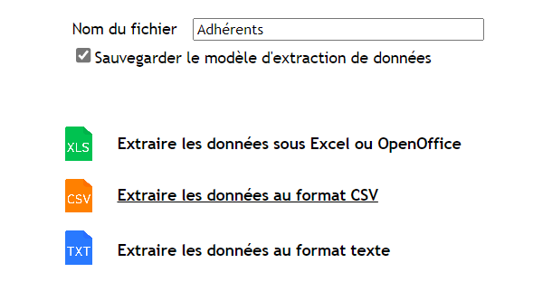

### Import depuis le site <RoleLevelComponent level="admin" />
> URL : https://narvik.app/admin/imports/members

La page est accessible depuis le menu d'administration.

Le fichier envoyé doit obligatoirement être au format CSV.

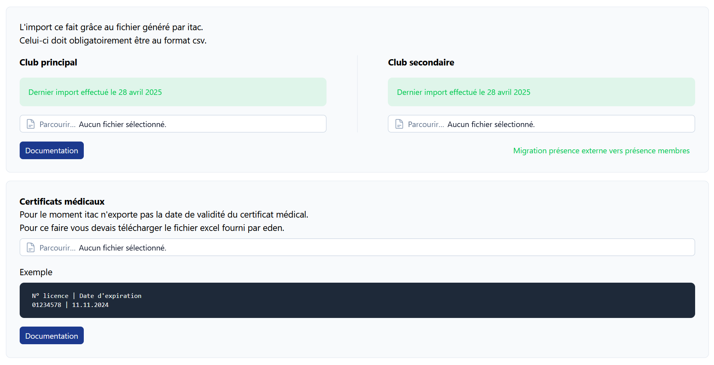

## Import des membres club secondaire
L'import se fait depuis un CSV généré depuis le site itac

- [Export depuis itac](#export-depuis-itac-1)
- [Import depuis le site](#import-depuis-le-site-1)

### Export depuis itac
1. Se rendre sur le **Requêteur** : https://itac.pro/Requeteur/Requeteur.aspx
2. Utiliser le modèle `Adh-2nd-club` et cliquer sur CSV
3. Si le modèle n'existe pas :
    1. Créer un nouveau modèle `Cartes Club`  
       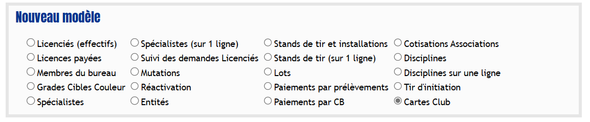
    2. Sélectionner toutes les saisons  
       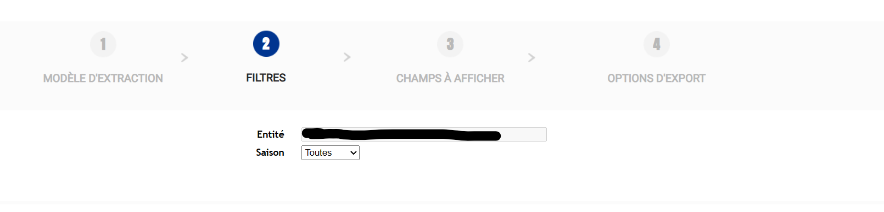
    3. Cocher tout les champs  
       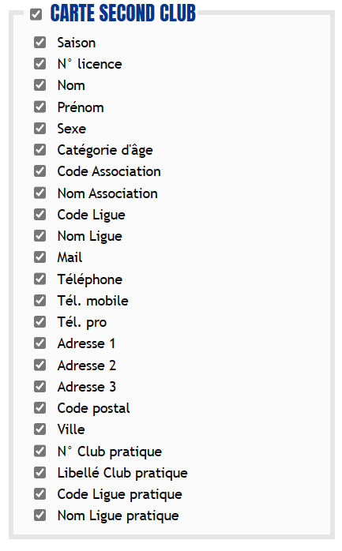
    4. Nommer le fichier `Adh-2nd-club`
    5. Cliquer sur `Sauvegarder le modèle d'extraction de données`
    6. Cliquer sur `Extraire les données au format CSV`
       L'export se télécharge automatiquement et peut prendre un peu de temps.
       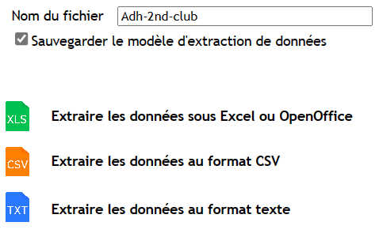

### Import depuis le site <RoleLevelComponent level="admin" />
> URL : https://narvik.app/admin/imports/members

La page est accessible depuis le menu d'administration.

Le fichier envoyé doit obligatoirement être au format CSV.

Une fois l'import effectué, une migration des présences externes vers présence membres est automatiquement effectuée.

## Import des certificats médicaux
L'import se fait depuis un XLSX généré depuis le site eden

- [Export depuis eden](#export-depuis-eden)
- [Import depuis le site](#import-depuis-le-site-2)

### Export depuis eden
1. Se rendre sur la page **Mon Club > Gérer mes adherents** : https://eden.fftir.org/#/espace-club/gestion-adherents
2. Cocher la case en haut du tableau permettant de sélectionner tous les adhérents  
   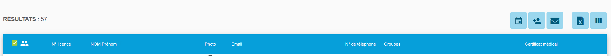
3. Cliquer sur l'icône Fichier X à droite

### Import depuis le site <RoleLevelComponent level="admin" />
> URL : https://narvik.app/admin/imports/members

La page est accessible depuis le menu d'administration.

Le fichier envoyé doit obligatoirement être au format XLSX.

## Import des photos

### Export depuis itac
1. Se rendre à l'adresse suivante https://itac.pro/Requeteur/ExportClub.aspx
2. Sélectionner `Export des photos`   
   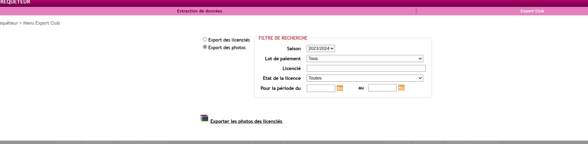
3. Télécharger le fichier zip fourni par itac sur le site

### Import depuis le site <RoleLevelComponent level="admin" />
> URL : https://narvik.app/admin/imports/photos

La page est accessible depuis le menu d'administration.

Le fichier envoyé doit obligatoirement être l'archive générée depuis itac.
