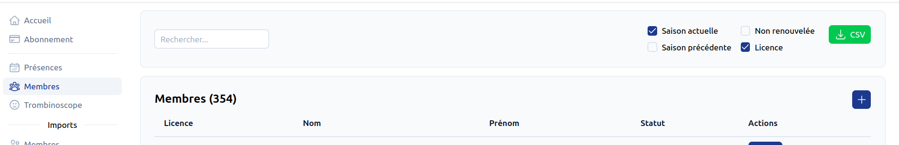

# Import des membres <RoleLevelComponent level="admin" />

L'import se fait depuis un CSV généré depuis le site.

- [Export](#export)

## Export <RoleLevelComponent level="admin" />
> URL : https://narvik.app/admin/members

L'export en csv est possible depuis la liste des membres.

