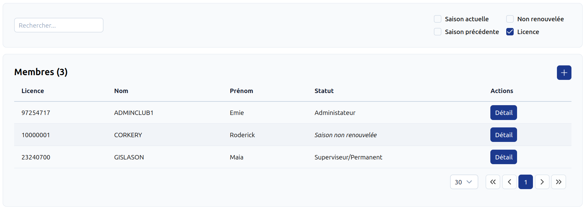
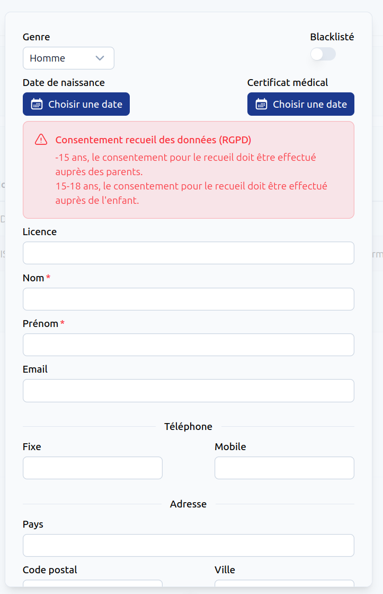
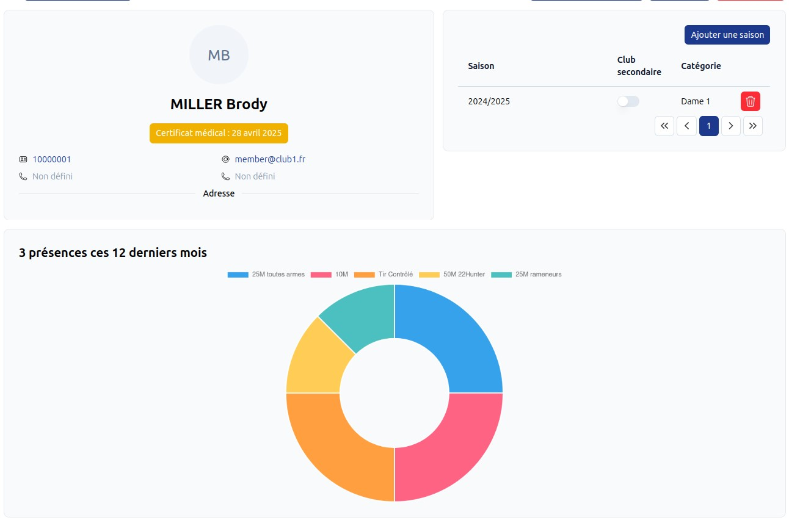

# Gestion membre <RoleLevelComponent level="supervisor" />

## Liste <RoleLevelComponent level="supervisor" />
La liste affiche par défaut les membres de la saison actuelle.

La recherche est appliquée sur :

- Numéro de licence
- Nom
- Prénom

En cliquant sur une ligne, la fiche détaillée est retournée.

Le bouton `+` permet la création d'une nouvelle fiche membre.

Une fois la fiche membre créée, il est possible d'ajouter celui-ci à une saison.

## Informations détaillées <RoleLevelComponent level="supervisor" />

Actions possibles :

- Modification du rôle/permissions <RoleLevelComponent level="admin" />
- Suppression du compte <RoleLevelComponent level="admin" />
- Ajout/Suppression d'une saison (club principal ou secondaire) <RoleLevelComponent level="admin" />
- Affichage des statistiques de présences <RoleLevelComponent level="supervisor" />
  - 12 dernièrs mois
  - Possibilité de modifier/supprimer une présence <RoleLevelComponent level="admin" />

