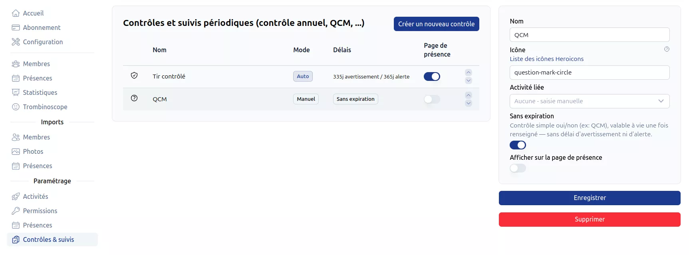
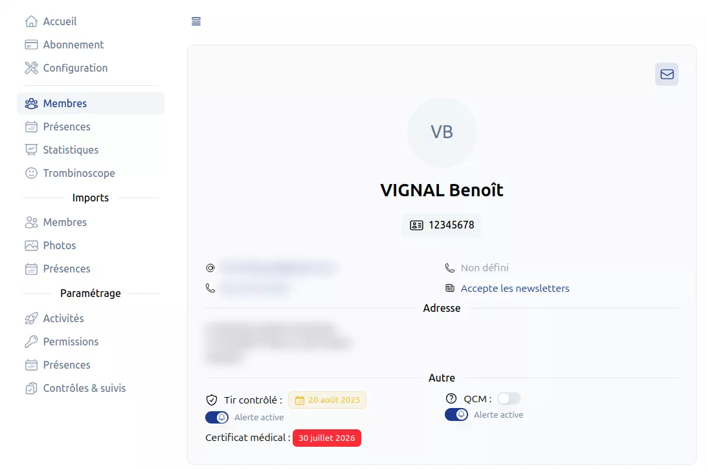

# Contrôles des membres <RoleLevelComponent level="admin" />

Le club peut définir ses propres contrôles périodiques par membre (contrôle annuel, QCM, ...),
chacun avec son icône, son mode de mise à jour (automatique ou manuel) et ses délais d'alerte.

## Configuration des types de contrôle <RoleLevelComponent level="admin" />
> URL : https://narvik.app/admin/config/member-controls

::: info
Cette page est accessible aux administrateurs, ainsi qu'aux superviseurs disposant de la
permission `Gestion des contrôles membres`.
:::

Un type de contrôle dispose des champs suivants :

- **Nom** et **icône** (icône [Heroicons](https://heroicons.com/), ex : `shield-check`)
- **Activité liée** (optionnel) : si définie, la date est automatiquement mise à jour depuis la
  dernière présence enregistrée sur cette activité. Sinon, la date est saisie manuellement sur la
  [fiche du membre](#suivi-sur-la-fiche-membre)
- **Délai d'avertissement** et **délai d'alerte** (en jours) : déterminent la couleur affichée
  (neutre, orange, rouge) en fonction de l'ancienneté de la dernière date enregistrée
- **Sans expiration** : laisser ces deux délais vides transforme le contrôle en simple suivi
  oui/non (ex : un QCM validé une fois pour toutes), sans jamais d'alerte
- **Afficher sur la fiche de présence** : si activé, le contrôle apparaît sur la fiche affichée
  lors du pointage d'un membre

::: warning Activité liée
Une fois une activité liée, la date n'est plus modifiable manuellement sur la fiche membre : elle suit automatiquement les présences enregistrées sur cette activité.
:::

L'ordre d'affichage des contrôles se change en cliquant sur les flèches situées à droite dans le tableau.

## Suivi sur la fiche membre <RoleLevelComponent level="supervisor" />

Sur la [fiche détaillée d'un membre](/frontend/docs/membres/administration#informations-détaillées),
chaque contrôle configuré apparaît avec sa dernière date et, pour un superviseur :

- Pour un contrôle **manuel** : la date se modifie directement (clic sur le champ) et peut être effacée
- Pour un contrôle **manuel sans expiration** : un simple interrupteur marque le contrôle comme passé (date du jour) ou non
- Pour un contrôle **automatique** (lié à une activité) : la date est en lecture seule, mise à jour uniquement par les présences
- Une alerte peut être désactivée individuellement par membre (utile pour une dispense ponctuelle), sans affecter la configuration du club

## Affichage sur la fiche de présence

Les contrôles marqués **Afficher sur la fiche de présence** apparaissent, avec une alerte visuelle (orange ou rouge selon les délais configurés), sur la fiche affichée lors du [pointage](/frontend/docs/membres/presences) d'un membre.
