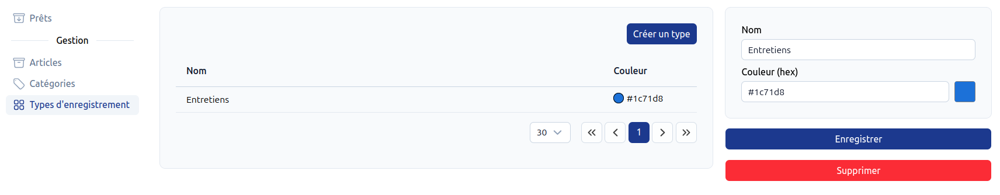
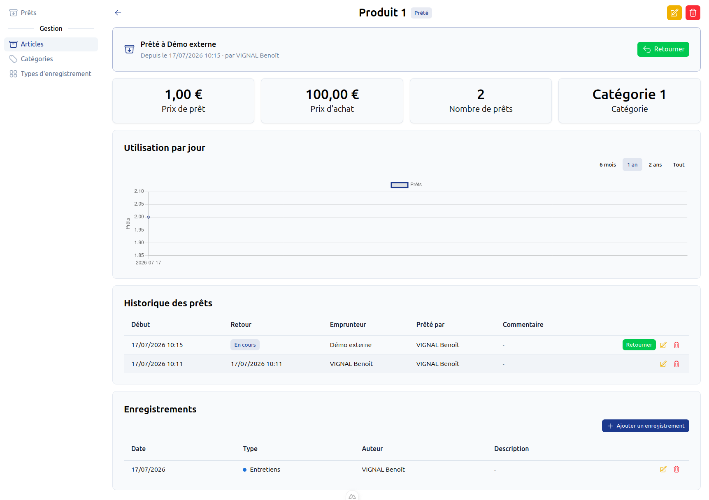

# Gestion des articles de prêt <RoleLevelComponent level="admin" />

Le module de Prêt permet de gérer un ensemble de matériel prêté ainsi que son historique complet (entretiens et utilisations).

La configuration est faite sur 3 pages

- Catégories
  - Création
  - Changement de l'ordre
- Types d'enregistrement (pour les notes de maintenance/entretien)
- Articles (création d'un article de prêt)

## Catégories <RoleLevelComponent level="admin" />
> URL : https://narvik.app/admin/loans/categories

::: info Suppression
Contrairement à l'inventaire du point de vente, supprimer une catégorie **ne supprime pas** les articles qu'elle contient : ceux-ci sont simplement déplacés dans "Sans catégorie".
:::

Le changement d'ordre d'une catégorie s'effectue en cliquant sur les flèches bleues situées à
droite dans le tableau. Cet ordre est utilisé pour le regroupement des articles sur la page
[Prêts](./prets#page-prêts).

## Types d'enregistrement <RoleLevelComponent level="admin" />
> URL : https://narvik.app/admin/loans/recording-types

Un type d'enregistrement permet de catégoriser une note ajoutée sur un article (nettoyage,
révision, panne, contrôle...). Chaque type dispose d'un nom et d'une couleur, utilisée pour
l'identifier rapidement dans l'historique d'un article.

## Articles <RoleLevelComponent level="admin" />

### Listing
> URL : https://narvik.app/admin/loans/items

Lors de la sélection d'un article sur le côté droit de la page apparaît un récapitulatif de celui-ci ainsi qu'un bouton redirigeant vers la [fiche complète](#fiche-article).

### Création / modification
Un article dispose des champs suivants :

- **Nom** et **description**
- **Image** (affichée sur les cartes et la fiche détaillée)
- **Catégorie**
- **Prix de prêt**, **prix d'achat** et **prix de vente**
- **Statut** : Disponible, Maintenance, Vendu ou Retiré
- **Visible sur la page de vente** : si activé, l'article apparaît dans l'encart "Matériel en prêt" lors d'une vente au [point de vente](/frontend/docs/pos/ventes)

::: warning Statut
Seuls les articles au statut **Disponible** peuvent être prêtés. Un article en maintenance, vendu
ou retiré ne pourra pas être sélectionné pour un nouveau prêt, que ce soit depuis la page
[Prêts](/frontend/docs/pret/prets) ou depuis le [point de vente](/frontend/docs/pos/ventes).
:::

## Fiche article <RoleLevelComponent level="admin" />

Cette page permet d'avoir une vue détaillée d'un article :

- Prix de prêt, prix d'achat, nombre de prêts total et catégorie
- Un graphique d'utilisation par jour, avec sélection de la période (6 mois, 1 an, 2 ans, tout)
- Un encart récapitulatif si l'article est actuellement prêté (emprunteur, date de début, prêté par, commentaire), avec un bouton `Retourner` pour enregistrer le retour en un clic
- L'historique complet des prêts de l'article
- Les enregistrements (notes de maintenance/entretien) associés à l'article

L'édition ou la suppression de l'article est possible en cliquant sur les boutons situés en haut à droite de la page.

### Enregistrer un prêt depuis la fiche article
Le bouton `Enregistrer un prêt` (grisé si l'article est déjà en cours de prêt ou n'est pas
disponible) ouvre une fenêtre permettant de choisir :

- L'emprunteur : soit un **membre du club** (recherche par nom/licence), soit une **personne
  extérieure** (nom libre)
- La personne qui prête le matériel (`Prêté par`)
- Un commentaire optionnel

### Ajouter un enregistrement
Le bouton `Ajouter un enregistrement` permet de noter un événement sur l'article (nettoyage,
panne, révision...), avec un type, un auteur et une description.
