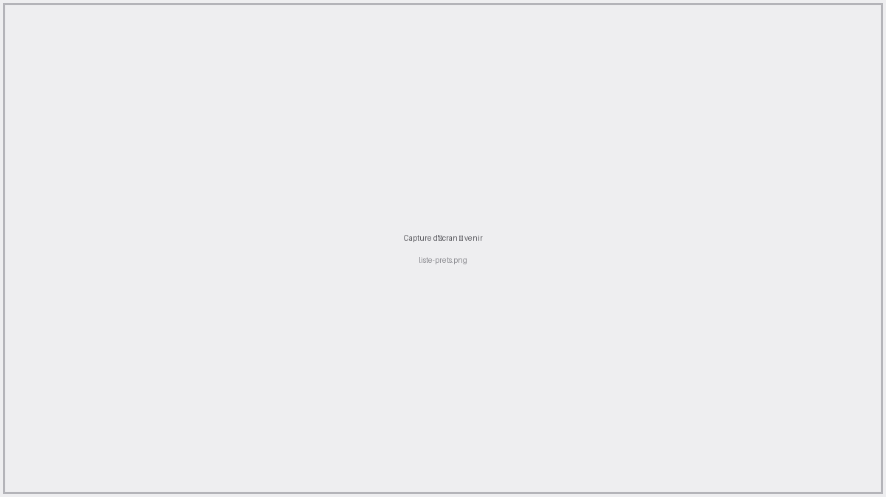
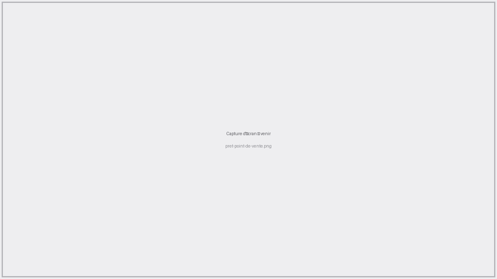
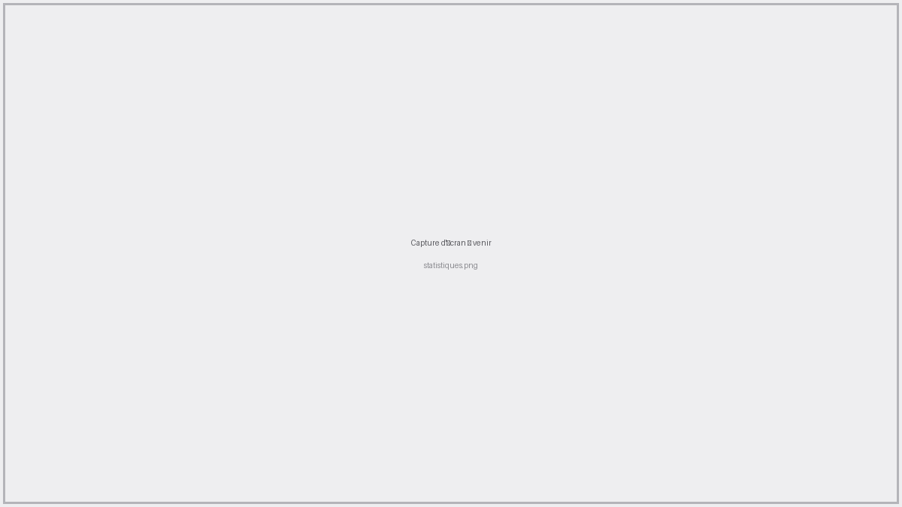

# Prêts <RoleLevelComponent level="supervisor" />

## Page Prêts <RoleLevelComponent level="supervisor" />
> URL : https://narvik.app/admin/loans

Cette page regroupe tous les articles disponibles au prêt (statut **Disponible**), classés par
catégorie puis par ordre alphabétique.

Chaque carte affiche l'image de l'article (si disponible), son nom, son prix de prêt ainsi que son
statut actuel :

- **Disponible** : l'article peut être prêté
- **Prêté** : l'article est actuellement chez un emprunteur

::: info
Les articles en Maintenance, Vendus ou Retirés n'apparaissent pas sur cette page. Retrouvez-les
sur la page [Articles](/frontend/docs/pret/articles#listing) de l'administration.
:::

Cliquer n'importe où sur une carte redirige vers la [fiche détaillée](/frontend/docs/pret/articles#fiche-article)
de l'article.

### Prêter un article
Le bouton `Prêter` ouvre une fenêtre permettant de choisir l'emprunteur (membre du club ou
personne extérieure), la personne qui prête le matériel, ainsi qu'un commentaire optionnel.

### Retourner un article
Lorsqu'un article est prêté, le bouton `Prêter` est remplacé par `Retourner`, qui enregistre
immédiatement la date de retour, sans quitter la page.

### Impression de la liste
Pour imprimer la liste des articles (utile pour un inventaire physique), il suffit de faire
"Imprimer la page" depuis votre navigateur.

Le raccourci clavier pour la plupart des navigateurs est : `Ctrl` + `P`

## Prêter/retourner depuis le point de vente <RoleLevelComponent level="supervisor" />
Lors d'une [vente](/frontend/docs/pos/ventes), si des articles de prêt sont configurés comme
"Visible sur la page de vente", un encart `Matériel en prêt` apparaît sous le panier. Il permet de
prêter ou retourner un article rapidement, sans quitter la vente en cours.

## Statistiques <RoleLevelComponent level="supervisor" />
> URL : https://narvik.app/admin/statistics/loans

La page de statistiques permet de suivre l'activité de prêt sur une période donnée (personnalisée
ou par saison), avec une comparaison automatique par rapport à la période précédente :

- Total de prêts sur la période, avec évolution
- Moyenne journalière, total sur les 30 et 365 derniers jours
- Prêts en cours, articles distincts prêtés, emprunteurs distincts
- Un graphique du nombre de prêts par mois
- Le classement des articles les plus demandés
- Le détail par article (nombre de prêts, en cours, moyenne journalière, évolution)

Un sélecteur permet de basculer entre une vue **Globale** (tous les articles confondus) et une vue
détaillée pour un article spécifique.
